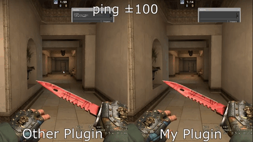

# VIP_Bhop

**VIP-бхоп без зависимости от пинга (без прилипания к полу)**

Модифицированная версия VIP BHOP с циклом включения/отключения, уведомлениями и отдельным конфигом.

> 🤖 **Разработано с помощью AI** | GitHub Copilot и Claude Haiku

---

## Описание

VIP_Bhop включает авто-бхоп только для VIP-игроков и управляет доступом по времени: сколько секунд бхоп активен и сколько секунд идет перезарядка. Также поддерживаются Alert/чат уведомления с переводами. Главная особенность — бхоп не зависит от пинга, поэтому нет прилипания к полу.

## Видео

Сравнительное видео.

[](https://youtu.be/8scl9fwa_Mc)

[Открыть на YouTube](https://youtu.be/8scl9fwa_Mc)

---

## Поддержка других игр (возможная)

Плагин написан под SourceMod и может работать в других играх на движке Source, если доступны SourceMod и VIP-Core. Возможные кандидаты: CS:S, TF2, DoD:S, HL2DM и другие моды Source.  
Проверено и протестировано только в CSGO.


---

## Функции

- VIP-бхоп только для игроков с доступом к функции `bhop`
- Включение/выключение по таймеру: `bhop_allowtime` и `bhop_locktime`
- Учет `mp_freezetime` при старте раунда
- Alert/чат уведомления с переводами
- Настройка адресатов уведомлений (все или только VIP)
- Репликация `sv_enablebunnyhopping` и `sv_autobunnyhopping` только VIP-игрокам
- Безопасный сброс таймеров при смене раунда и отключении клиента
- Не зависит от пинга (нет прилипания к полу)

## Требования

- SourceMod 1.10+
- VIP-Core

## Установка

1. Убедитесь, что установлены SourceMod и VIP-Core
2. Скопируйте файлы в соответствующие директории:

```
VIP_Bhop.zip
├── addons/sourcemod/
│   ├── plugins/
│   │   └── VIP_Bhop.smx               ← Готовый плагин
│   ├── scripting/
│   │   └── VIP_Bhop.sp                ← Исходный код
│   └── translations/
│       └── vip_bhop.phrases.txt       ← Переводы и префиксы
└── cfg/vip/
	└── VIP_Bhop.cfg                   ← Консольные переменные
```

3. Перезагрузите сервер

## Настройка VIP-Core

Включите фичу `bhop` для нужных групп в `groups.ini`.

Пример:
```
"bhop"    "1"
```

Если используете меню VIP-Core, добавьте пункт в `vip_modules.phrases.txt`:

```
"bhop"
{
	"ru"       "Банихоп"
	"ua"       "Банніхоп"
	"en"       "BunnyHop"
	"pt"       "Salto do Coelho"
	"fi"       "Kaniini-hyppy"
}
```

## Конфигурация (ConVar)

| ConVar | Значение по умолчанию | Описание |
|---|---:|---|
| `bhop_allowtime` | 5 | Сколько секунд доступен бхоп (0 = всегда) |
| `bhop_locktime` | 15 | Сколько секунд перезарядки между включениями (0 = без перезарядки) |
| `bhop_info` | 2 | Уведомления: 0 выкл, 1 чат, 2 Alert |
| `bhop_notify` | 0 | Кому писать: 0 всем, 1 только VIP с доступом |

## Переводы и цвета

Файл переводов: `addons/sourcemod/translations/vip_bhop.phrases.txt`.
Там можно изменить тексты, префиксы и цветовую схему.

## Команды

Глобальная команда `!vip` — в меню можно включить или выключить бхоп.

## Сравнение с бесплатными версиями

Сравнение сделано по исходникам, которые лежат в репозитории:
- `VIP_BHOP_1.0.2.sp` (KOROVKA)
- `vip_bhop.sp` (MaZa 1.2)

| Возможность | VIP_Bhop (текущий) | VIP_Bhop 1.2 (MaZa) | VIP_BHOP 1.0.2 (KOROVKA) |
|---|---|---|---|
| Тип VIP-фичи | FLOAT | FLOAT | BOOL |
| Задержка перед включением | Да (`bhop_locktime` + `mp_freezetime`) | Да (через значение фичи) | Нет |
| Включение/выключение по таймеру | Да (`bhop_allowtime`) | Нет | Нет |
| Перезарядка между включениями | Да (`bhop_locktime`) | Нет | Нет |
| Alert/чат уведомления | Да (несколько типов) | Да (только старт) | Нет |
| Кому отправлять уведомления | Да (все/только VIP) | Нет | Нет |
| Пер-клиент включение `sv_enablebunnyhopping` | Да | Нет | Нет |
| Очистка таймеров при смене раунда | Да | Нет | Нет |
| Проверка воды | Нет | Нет | Да |

## Почему текущая версия лучше для продакшна

- Гибкие тайминги: можно включать и выключать бхоп по таймеру на протяжении раунда
- Аккуратные уведомления с переводами и ограничением спама
- Безопасное управление состоянием и таймерами при смене раунда/отключении

Если нужен максимально простой и всегда включенный бхоп — версия 1.0.2 проще и легче. Если нужен настраиваемый VIP-бхоп с таймингами и уведомлениями — текущая версия функциональнее.
